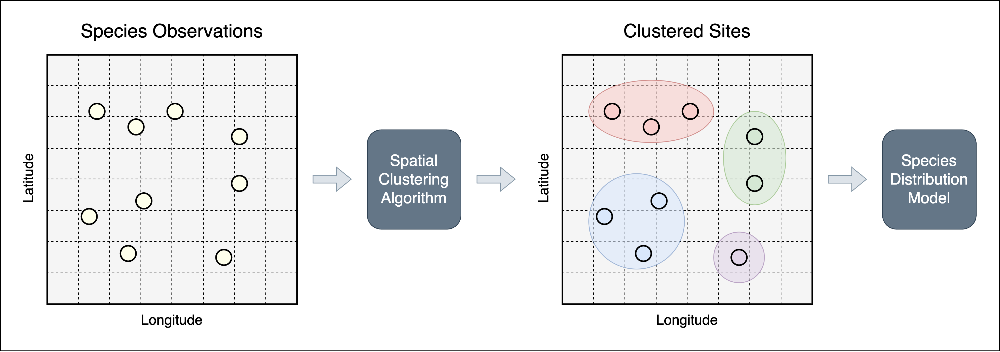

<!-- 
README for "Spatial Clustering of Citizen Science Data Improves Downstream Species Distribution Models"

# Nahian Ahmed
# December 10, 2024 
-->

# Spatial Clustering of Citizen Science Data Improves Downstream Species Distribution Models


<p align="center">
  
</p>


## Data 

Data available at <https://doi.org/10.5281/zenodo.14362178>.

`occupancy_feature_raster` contains raster file of occupancy/site features, and `checklist_data` contains eBird checklists of 31 species. 

Please place both directories in root directory before executing code.


## Requirements

Code was last run using `R` version 4.4.2, `gdal` version 3.10.0, `geos` version 3.13.0, and `proj` version 9.5.0.

Required `R` packages are listed in `dependencies.txt`.

## Instructions


Run the following command:

`Rscript run_species_experiments.R`

Replace `species_names` in `run_species_experiments.R` to run experiments for specific species. Abbreviations of species names are in `checklist_data` (e.g, `NOFL` = Northern Flicker, `COHA` = Cooper's Hawk, etc.).

## Citation

```
@inproceedings{ahmed2025spatial,
  title={Spatial Clustering of Citizen Science Data Improves Downstream Species Distribution Models},
  author={Ahmed, Nahian and Roth, Mark and Hallman, Tyler A and Robinson, W Douglas and Hutchinson, Rebecca A},
  booktitle={Proceedings of the AAAI Conference on Artificial Intelligence},
  volume={39},
  number={27},
  pages={27775--27783},
  year={2025}
}
````
